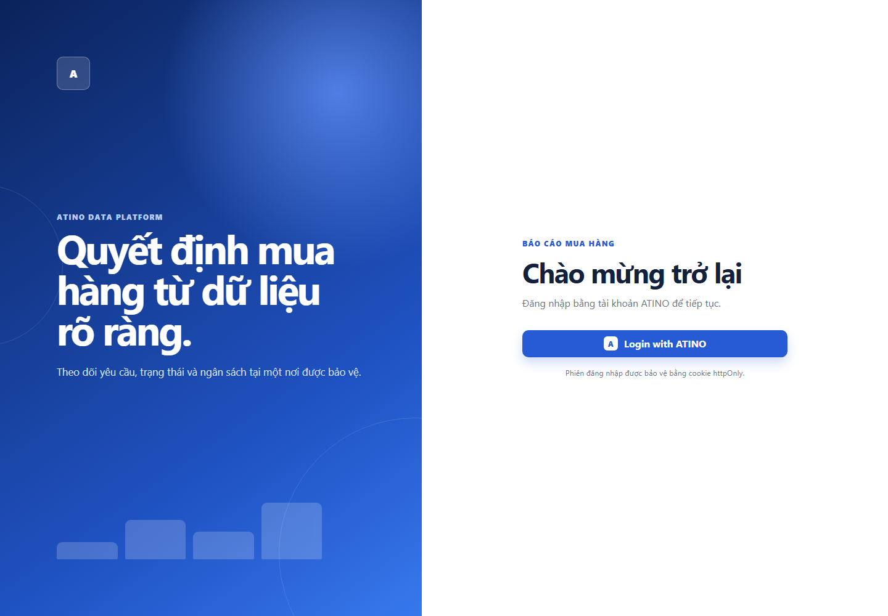
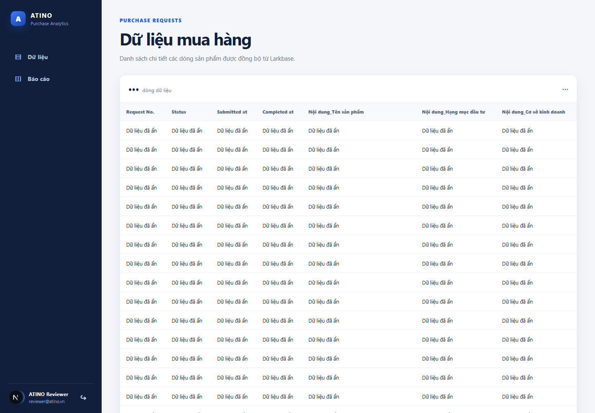
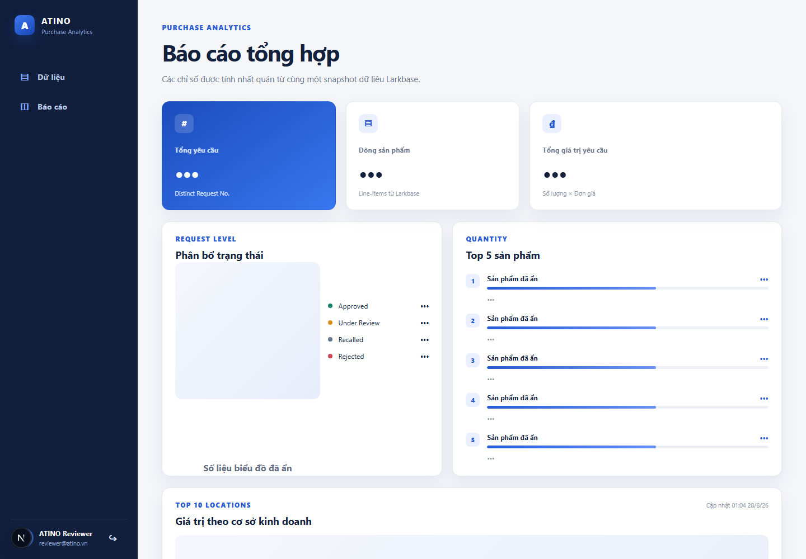

# ATINO Purchase Analytics

Web application TypeScript kết nối Larkbase, hiển thị dữ liệu yêu cầu mua hàng, báo cáo tổng hợp và xác thực người dùng qua ATINO HUB.

## Công nghệ

- Next.js App Router + React + TypeScript strict
- TanStack Table
- Recharts
- Zod
- iron-session
- Vitest

## Cấu trúc dự án

```text
src/
├── app/                     # Routes, layouts và internal API
│   ├── (protected)/         # Các trang yêu cầu session hợp lệ
│   ├── api/                 # API cho browser; luôn kiểm tra session
│   ├── auth/                # Login, callback và logout
│   └── login/               # Giao diện đăng nhập
├── components/              # UI chia theo data, reports, layout, shared
├── domain/purchase/         # Types, validation và normalization
├── lib/                     # Hàm format dùng chung
└── server/                  # Code chỉ được chạy phía server
    ├── auth/                # OAuth client, state và session
    ├── config/              # Validation biến môi trường
    ├── http/                # Timeout/retry
    ├── lark/                # Token cache, pagination, data cache
    └── reports/             # Business rules tính KPI
tests/                       # Unit tests cho domain/report
```

Luồng phụ thuộc đi từ UI → internal API → service/repository → external API. Domain layer không phụ thuộc UI hoặc framework.

## Cài đặt và chạy local

Yêu cầu Node.js 20 trở lên.

```bash
npm install
copy .env.example .env.local
npm run dev
```

Mở `http://localhost:5173`.

Điền các biến trong `.env.local` bằng thông tin được cấp riêng. Không commit file này.

Các lệnh kiểm tra:

```bash
npm run lint
npm run typecheck
npm run test
npm run build
```

## Biến môi trường

Tạo `.env.local` từ `.env.example` và điền các giá trị sau. Những biến được đánh dấu **server-only** tuyệt đối không được đặt trong code client hoặc commit lên Git.

| Biến | Bắt buộc | Mục đích |
| --- | --- | --- |
| `APP_URL` | Có | Origin của ứng dụng, local là `http://localhost:5173` |
| `SESSION_SECRET` | Có | Khóa mã hóa session, tối thiểu 32 ký tự, **server-only** |
| `DATA_CACHE_TTL_MS` | Có | Thời gian cache snapshot dữ liệu Larkbase, tính bằng millisecond |
| `LARK_APP_ID` | Có | App ID dùng để lấy tenant access token, **server-only** |
| `LARK_APP_SECRET` | Có | App secret của Lark, **server-only** |
| `LARK_APP_TOKEN` | Có | App token của Larkbase cần đọc |
| `LARK_TABLE_ID` | Có | ID bảng dữ liệu yêu cầu mua hàng |
| `ATINO_CLIENT_ID` | Có | OAuth client ID do ATINO HUB cấp |
| `ATINO_CLIENT_SECRET` | Có | OAuth client secret, **server-only** |
| `ATINO_AUTHORIZATION_URL` | Có | Endpoint authorize của ATINO HUB |
| `ATINO_TOKEN_URL` | Có | Endpoint đổi authorization code lấy access token, gọi ở server |
| `ATINO_USERINFO_URL` | Có | Endpoint lấy thông tin người dùng sau đăng nhập |
| `ATINO_REDIRECT_URI` | Có | Callback đã đăng ký; local là `http://localhost:5173/auth/callback` |

## Ảnh chụp giao diện

### Login



### Dữ liệu



### Báo cáo



Ảnh `/data` và `/report` được chụp từ ứng dụng local với session kiểm thử chỉ dùng để minh họa giao diện. Nội dung nghiệp vụ và số liệu chi tiết đã được che trước khi đưa lên repository public; credentials và session không được lưu trong repository.

## CI/CD

GitHub Actions chạy tự động trên pull request và mỗi lần push vào `main`:

1. Cài dependency bằng `npm ci`.
2. Audit production dependency ở mức `high` trở lên.
3. Chạy ESLint, TypeScript typecheck và unit test.
4. Build ứng dụng Next.js ở chế độ standalone.
5. Khi push vào `main`, lưu standalone build artifact trong 14 ngày.

Workflow nằm tại `.github/workflows/ci.yml`. Pipeline chỉ sử dụng placeholder an toàn trong bước build; credentials thật không được đưa vào GitHub Actions hoặc repository. Khi cần deploy production, cấu hình secrets trực tiếp trong GitHub/Vercel thay vì commit `.env.local`.

## Deploy production

- URL: [https://atino-sigma.vercel.app](https://atino-sigma.vercel.app)
- Hosting: Vercel, project `trucdz17012003-5736/atino`.
- Repository GitHub đã được kết nối với Vercel; push vào `main` sẽ tự tạo production deployment mới.
- Production callback: `https://atino-sigma.vercel.app/auth/callback`.
- Toàn bộ credentials được lưu dưới dạng Vercel Secret, không nằm trong source code hoặc GitHub repository.

Nếu cấu hình OAuth tại ATINO HUB thay đổi, callback production ở trên phải tiếp tục nằm trong allowlist của OAuth client.

## Luồng xác thực

1. `/auth/login` sinh state ngẫu nhiên, lưu trong encrypted httpOnly cookie rồi redirect đến ATINO HUB.
2. `/auth/callback` kiểm tra state và thời hạn trước khi đổi authorization code lấy token.
3. Token và client secret chỉ được sử dụng ở server.
4. App gọi userinfo và tạo session riêng có thời hạn tối đa tám giờ.
5. Protected layout xác minh session cho page; mỗi API cũng xác minh session độc lập.
6. `/auth/logout` hủy session.

Redirect URI local phải là `http://localhost:5173/auth/callback`.

## Khảo sát và xử lý dữ liệu

Snapshot được khảo sát có:

- 568 line-items.
- 147 `Request No.` khác nhau.
- 86 request có nhiều hơn một line-item; request lớn nhất có 48 dòng.
- `Số lượng` và `Đơn giá` được trả về dạng chuỗi dù tên field gợi ý dữ liệu số.
- 46 dòng thiếu `Completed at`; toàn bộ thuộc `Under Review` trong snapshot khảo sát.
- 13 dòng thiếu `Hạng mục đầu tư` và 13 dòng thiếu `Tên nhà cung cấp`.
- Tên sản phẩm có khác biệt nhỏ về khoảng trắng/cách viết.

| Bất thường | Cách xử lý |
| --- | --- |
| Một `Request No.` xuất hiện trên nhiều dòng vì mỗi dòng là một sản phẩm | Giữ nguyên line-item cho bảng; báo cáo tổng yêu cầu và trạng thái nhóm theo `Request No.` để không đếm trùng |
| `Số lượng` và `Đơn giá` là chuỗi thay vì number | Trim, chuyển bằng `Number`, chỉ chấp nhận số hữu hạn không âm; dữ liệu sai làm request thất bại rõ ràng |
| Timestamp được trả về dưới dạng milliseconds | Chuyển thành ISO datetime ở domain layer, sau đó format theo locale `vi-VN` trên UI |
| `Completed at` trống ở các yêu cầu đang xử lý | Chuẩn hóa thành `null` và hiển thị dấu `—`; không tự suy diễn ngày hoàn thành |
| `Hạng mục đầu tư` hoặc `Tên nhà cung cấp` bị thiếu | Coi là field optional, chuẩn hóa thành `null` và hiển thị dấu `—` |
| Tên sản phẩm có khoảng trắng/cách viết không đồng nhất | Trim và gộp khoảng trắng; khi tổng hợp so sánh không phân biệt hoa thường, không fuzzy-merge vì có thể gộp nhầm sản phẩm |
| Một request có thể chứa trạng thái không nhất quán giữa các dòng | Chọn trạng thái của dòng có `Submitted at` mới nhất và phát cảnh báo chất lượng dữ liệu |

Sau normalization, `lineValue` luôn được tính nhất quán bằng `quantity × unitPrice`.

Ứng dụng fail rõ ràng nếu field bắt buộc hoặc giá trị số/ngày không hợp lệ, thay vì âm thầm tạo KPI sai.

## Định nghĩa báo cáo

Do một `Request No.` có thể xuất hiện trên nhiều dòng sản phẩm, bốn chỉ số có thể được hiểu theo cả cấp **request** và cấp **line-item**. Ứng dụng chọn và áp dụng nhất quán các định nghĩa sau:

### 1. Tổng số yêu cầu mua hàng

- **Cách hiểu đã chọn:** số lượng `Request No.` phân biệt: `COUNT(DISTINCT Request No.)`.
- **Không chọn:** tổng số record/line-item trong Larkbase.
- **Lý do:** một yêu cầu có thể chứa nhiều sản phẩm nên xuất hiện trên nhiều dòng. Đếm record sẽ làm một yêu cầu lớn bị tính nhiều lần và không phản ánh đúng số yêu cầu mua hàng thực tế.

Dashboard vẫn hiển thị thêm “Dòng sản phẩm” như một chỉ số phụ để người đọc phân biệt rõ hai cấp dữ liệu.

### 2. Phân bổ theo trạng thái

- **Cách hiểu đã chọn:** phân bổ ở cấp request; mỗi `Request No.` chỉ đóng góp một đơn vị vào đúng một trạng thái.
- **Trường hợp các dòng cùng request có trạng thái khác nhau:** chọn trạng thái của dòng có `Submitted at` mới nhất và tăng bộ đếm cảnh báo `inconsistentRequestStatuses`.
- **Lý do:** trạng thái mô tả vòng đời của toàn bộ yêu cầu, không phải số lượng sản phẩm trong yêu cầu. Dùng dòng mới nhất là giả định gần nhất với trạng thái hiện tại, đồng thời cảnh báo giúp không che giấu bất thường của dữ liệu nguồn.

### 3. Top 5 sản phẩm được yêu cầu nhiều nhất

- **Cách hiểu đã chọn:** xếp hạng theo tổng `Nội dung_Số lượng` của từng sản phẩm trên toàn bộ line-item, không xếp theo số dòng xuất hiện.
- **Chuẩn hóa tên trước khi nhóm:** trim, gộp khoảng trắng liên tiếp và so sánh không phân biệt hoa/thường. Không fuzzy-merge các tên gần giống nhau.
- **Thứ tự khi bằng tổng số lượng:** ưu tiên sản phẩm có nhiều line-item hơn, sau đó sắp xếp theo tên để kết quả ổn định.
- **Lý do:** “được yêu cầu nhiều nhất” được hiểu là nhu cầu về số đơn vị hàng hóa; một dòng có quantity 100 phải có trọng số lớn hơn một dòng có quantity 1. Không fuzzy-merge vì tên gần giống vẫn có thể là hai quy cách sản phẩm khác nhau.

### 4. Tổng giá trị theo cơ sở kinh doanh

- **Cách hiểu đã chọn:** với mỗi line-item, tính `lineValue = Nội dung_Số lượng × Nội dung_Đơn giá`, sau đó cộng `lineValue` theo `Nội dung_Cơ sở kinh doanh`.
- **Đơn vị hiển thị:** VND; không cộng VAT, chiết khấu hoặc phí khác vì nguồn dữ liệu không cung cấp các trường đó.
- **Lý do:** đây là cách duy nhất có thể suy ra nhất quán giá trị tiền từ các cột hiện có. Đếm request hoặc cộng đơn giá trực tiếp sẽ sai khi quantity lớn hơn 1.

Mọi báo cáo dùng cùng một normalized snapshot được cache phía server, tránh lệch dữ liệu giữa các widget.

## Cache và xử lý lỗi

- Lark tenant token được cache đến trước expiry 60 giây.
- Dữ liệu được cache in-memory theo `DATA_CACHE_TTL_MS`.
- Các request đồng thời dùng chung in-flight promise.
- External request có timeout, retry giới hạn cho lỗi mạng, HTTP 429 và 5xx.
- Pagination phát hiện page token bị thiếu/lặp và có giới hạn số trang.

## Bảo mật

- Không để Lark app secret hoặc ATINO client secret trong client bundle.
- Session cookie có `httpOnly`, `sameSite=lax` và `secure` ở production.
- OAuth state có thời hạn 10 phút và được so sánh constant-time.
- Page và API đều kiểm tra xác thực.
- Không ghi token/credentials vào log.

Thông tin kết nối trong tài liệu đề bài không nên xuất hiện trong repository public. Nên rotate secret sau đợt sử dụng nếu tài liệu đã được chia sẻ rộng.

## Giới hạn hiện tại

- Cache in-memory phù hợp bài test và single-instance; production nhiều instance nên dùng Redis hoặc shared cache.
- SSO của bản deploy có thể không hoạt động nếu ATINO HUB chỉ đăng ký redirect URI localhost.
- Không fuzzy-merge tên sản phẩm vì cần xác nhận nghiệp vụ trước khi gộp các tên gần giống nhau.

## Trạng thái nộp bài

- Repository public: [github.com/trucdz04/Atino](https://github.com/trucdz04/Atino).
- Production: [atino-sigma.vercel.app](https://atino-sigma.vercel.app).
- Đã hoàn thành các phần kết nối Larkbase, lấy và chuẩn hóa toàn bộ dữ liệu, trang dữ liệu, trang báo cáo và Login with ATINO SSO.
- GitHub Actions kiểm tra chất lượng và build; Vercel tự động deploy khi nhánh `main` được cập nhật.
